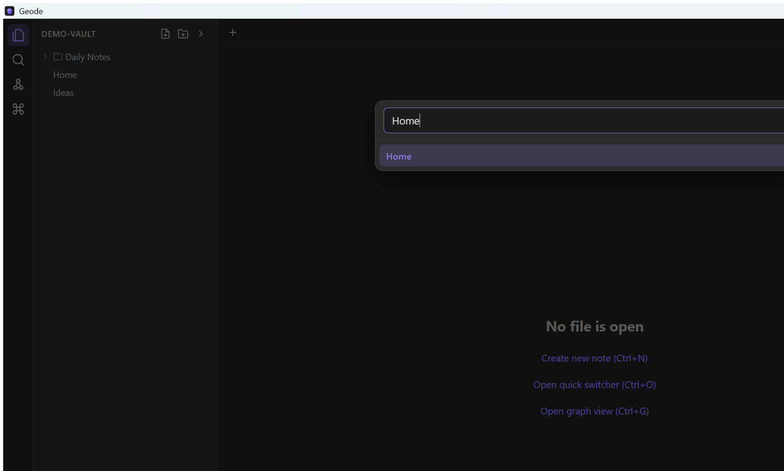
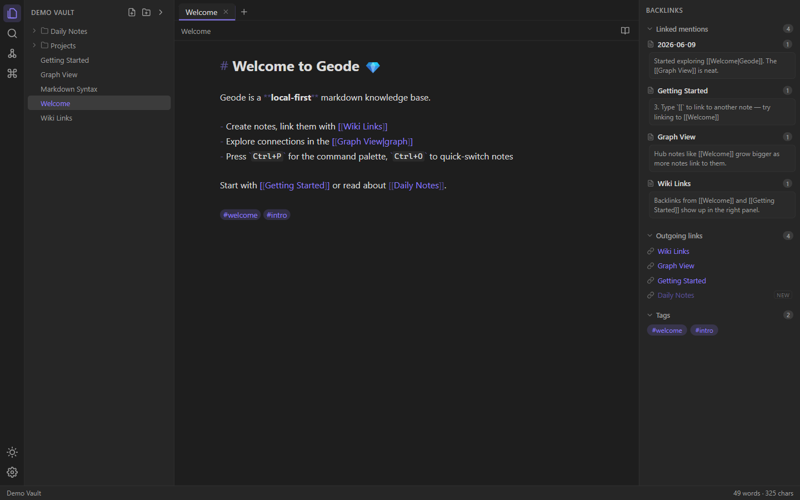
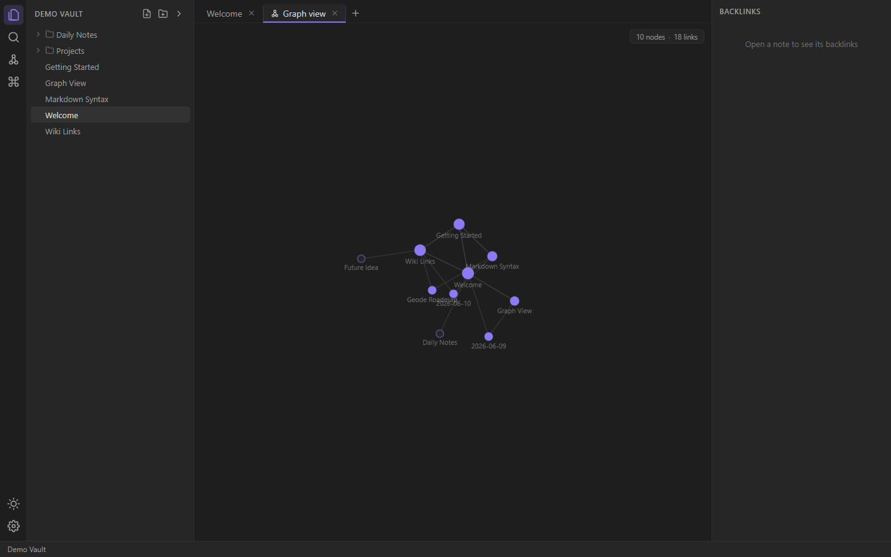
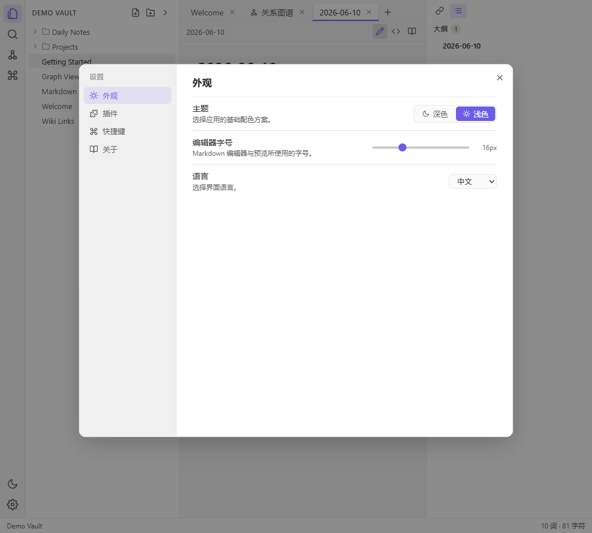

# Geode

[](https://github.com/AlexHercules/geode/actions/workflows/ci.yml)
[](LICENSE)

Geode is an open-source, Obsidian-like, local-first markdown knowledge base and note-taking app. It is built as a desktop app with Tauri, React, TypeScript, and CodeMirror 6.

The core promise is simple: your notes are plain `.md` files in a folder you own. Geode indexes and visualizes them, but it does not lock them into a database.

> Status: active alpha. Geode is already usable for local vaults and plugin-compatibility experiments, but APIs and packaging are still moving quickly.



## Why Geode exists

Obsidian has proven that plain files plus a great interaction model can feel better than a traditional note database. Geode explores that same local-first direction as an open-source Obsidian alternative with a desktop codebase, a plugin runtime, and a compatibility layer for Obsidian-style plugins.

Geode is not affiliated with Obsidian or Dynalist Inc. Obsidian is a trademark of its respective owner. The compatibility work in this repository is a clean-room implementation intended to help users keep their markdown vaults portable.

## Highlights

- Local-first vaults: open any folder and keep notes as regular markdown files.
- Live preview editor: CodeMirror 6 renders markdown in place while keeping syntax editable.
- Reading view: rendered markdown, task checkboxes, links, embeds, callouts, footnotes, math, Mermaid, and more.
- Graph view: force-directed global and local graph views with filters, groups, tags, attachments, and Obsidian-style circular layout tuning.
- Backlinks and outgoing links: navigate linked mentions, unlinked mentions, tags, footnotes, outline, and file properties.
- File explorer: tree view, create/rename/delete/move, context menus, reveal, attachment folder helpers, and ignored-file affordances.
- Workspace model: tabs, split panes, draggable tabs, persistent workspace layouts, bookmarks, sidebars, and command routing.
- Command palette and hotkeys: keyboard-first command registry with custom hotkeys.
- Search and quick switcher: full-text search, tag search, fast file switching, and create-on-miss.
- Plugin system: built-in and external plugins loaded from `<vault>/.geode/plugins/*.js`.
- Obsidian compatibility layer: a growing shim for Obsidian community plugins, including vault/workspace/metadata APIs, settings UI, modals, menus, notices, markdown rendering, and CodeMirror integration.
- Desktop shell: Tauri 2 backend for filesystem access, file watching, dialogs, updater plumbing, and native desktop packaging.
- Performance work: 10k-note benchmark mode, virtualized explorer, render caps, graph sampling, and documented perf probes.

## Current feature map

| Area | Status |
| --- | --- |
| Plain markdown vaults | Implemented |
| Live preview / source / reading modes | Implemented |
| Wikilinks, markdown links, block refs, headings | Implemented |
| Backlinks, outgoing links, tags, footnotes, outline | Implemented |
| Graph view, local graph, graph filters/groups | Implemented |
| File properties / frontmatter | Implemented |
| Attachments and embeds | Implemented |
| Export HTML / print-to-PDF | Implemented |
| External Geode plugins | Implemented |
| Obsidian plugin compatibility | In progress |
| Full commercial release packaging | In progress |

See [docs/ROADMAP.md](docs/ROADMAP.md) and [docs/OBSIDIAN_REPLICA_GAP_AUDIT.md](docs/OBSIDIAN_REPLICA_GAP_AUDIT.md) for the living roadmap and fidelity audit.

## Screenshots

| Editor | Graph | Settings |
| --- | --- | --- |
|  |  |  |

## Quick start

### Requirements

- Node.js 20 or newer
- npm
- Rust stable and Cargo
- Tauri system dependencies for your OS

For Tauri setup, follow the official Tauri prerequisites for your platform: <https://tauri.app/start/prerequisites/>.

### Run in browser mode

Browser mode uses an in-memory demo vault. It is fast to start and is the easiest way to inspect the UI or run browser E2E tests.

```sh
npm install
npm run dev
```

Then open <http://localhost:1420>.

### Run as a desktop app

```sh
npm run tauri dev
```

Desktop mode uses the real filesystem through the Tauri backend. On macOS/Linux development machines, you can also run the release binary directly against a vault path after building.

### Build

```sh
npm run typecheck
npm run build
npm run tauri build
```

The current bundle configuration targets Windows NSIS installers. Other platforms are developed from source and can be added as release targets later.

## Common commands

| Command | Purpose |
| --- | --- |
| `npm run dev` | Start Vite dev server at `http://localhost:1420` |
| `npm run typecheck` | Run TypeScript strict checks |
| `npm run build` | Typecheck and produce the web build in `dist/` |
| `npm run tauri dev` | Start the Tauri desktop app in development mode |
| `npm run tauri build` | Build the desktop bundle |

## Keyboard shortcuts

| Shortcut | Action |
| --- | --- |
| `Ctrl+P` / `Cmd+P` | Command palette |
| `Ctrl+O` / `Cmd+O` | Quick switcher |
| `Ctrl+N` / `Cmd+N` | New note |
| `Ctrl+E` / `Cmd+E` | Toggle edit / reading view |
| `Ctrl+G` / `Cmd+G` | Graph view |
| `Ctrl+D` / `Cmd+D` | Open today's daily note |
| `Ctrl+W` / `Cmd+W` | Close tab |
| `Ctrl+\` / `Cmd+\` | Split pane right |
| `Ctrl+Shift+\` / `Cmd+Shift+\` | Split pane down |
| `Ctrl+,` / `Cmd+,` | Settings |

Hotkeys are customizable in Settings.

## Project structure

```text
src/core/       Framework-free app model: vault, metadata, workspace, commands, stores
src/app/        React shell: layout, context, app-level command wiring
src/features/   User-facing feature modules: editor, explorer, graph, search, settings, panels
src/plugins/    Built-in Geode plugins
src/compat/     Obsidian compatibility layer
src/styles/     Shared application CSS
src-tauri/      Rust/Tauri backend
docs/           Architecture, roadmap, compatibility notes, performance docs
.calibration/   Local and CI-oriented regression harnesses
```

The architecture contract is intentionally strict: `core` does not import React feature code, features do not import each other, and compatibility code is isolated from first-party feature modules. See [docs/ARCHITECTURE.md](docs/ARCHITECTURE.md).

## Plugin development

Geode supports two plugin paths:

- Native Geode plugins, authored against Geode's public plugin API.
- Obsidian-style plugin compatibility, where Geode provides a growing `obsidian` shim.

External Geode plugins can be placed in:

```text
<vault>/.geode/plugins/*.js
```

Start with [docs/PLUGINS.md](docs/PLUGINS.md). Obsidian compatibility details and boundaries live in [docs/OBSIDIAN-COMPAT.md](docs/OBSIDIAN-COMPAT.md).

## Testing and calibration

Geode has a large regression harness accumulated during development. The most common local checks are:

```sh
npm run typecheck
npm run build
```

For browser E2E checks, start the dev server and run calibration scripts directly:

```sh
npm run dev
node .calibration/r23-e2e.mjs
node .calibration/r24-e2e.mjs
```

The CI workflow currently runs typecheck, production build, and a small browser regression slice. The broader calibration suite is used during focused development rounds.

Performance benchmarking is documented in [docs/PERFORMANCE.md](docs/PERFORMANCE.md). Use `?bench=10000` to seed a deterministic large in-memory vault:

```text
http://localhost:1420/?bench=10000
```

## Documentation

| Document | Contents |
| --- | --- |
| [docs/DEVELOPMENT.md](docs/DEVELOPMENT.md) | Setup, development discipline, verification notes |
| [docs/ARCHITECTURE.md](docs/ARCHITECTURE.md) | Layering, core APIs, component contracts, round contracts |
| [docs/ROADMAP.md](docs/ROADMAP.md) | Product mission, completed rounds, next work |
| [docs/PLUGINS.md](docs/PLUGINS.md) | Geode plugin authoring guide |
| [docs/OBSIDIAN-COMPAT.md](docs/OBSIDIAN-COMPAT.md) | Obsidian compatibility strategy and test matrix |
| [docs/OBSIDIAN_REPLICA_GAP_AUDIT.md](docs/OBSIDIAN_REPLICA_GAP_AUDIT.md) | Fidelity audit against Obsidian surfaces |
| [docs/PERFORMANCE.md](docs/PERFORMANCE.md) | 10k-note benchmark methodology and optimization notes |
| [docs/DISTRIBUTION.md](docs/DISTRIBUTION.md) | Packaging and updater notes |
| [docs/HANDOFF.md](docs/HANDOFF.md) | Continuation notes for development rounds |

Some historical planning notes are in Chinese because the project has been developed through Chinese-language design rounds. The public-facing README is in English so new contributors can orient quickly.

## Contributing

Contributions are welcome, especially bug reports, focused compatibility fixes, documentation improvements, and small UI fidelity patches.

Before opening a large PR, please read:

- [CONTRIBUTING.md](CONTRIBUTING.md)
- [docs/DEVELOPMENT.md](docs/DEVELOPMENT.md)
- [docs/ARCHITECTURE.md](docs/ARCHITECTURE.md)

Important boundaries:

- Do not commit private vault contents, local signing keys, or vendored community plugin bundles.
- Do not copy Obsidian proprietary code or assets.
- Keep compatibility work clean-room and document behavior using public APIs, user-observable behavior, or locally authored tests.

## License

Geode is licensed under the [Apache License 2.0](LICENSE).

I chose Apache-2.0 because Geode is intended to be permissive and commercially usable while also giving contributors and downstream users an explicit patent grant. That is a better fit for a desktop application and plugin compatibility layer than a minimal license with no explicit patent language.
